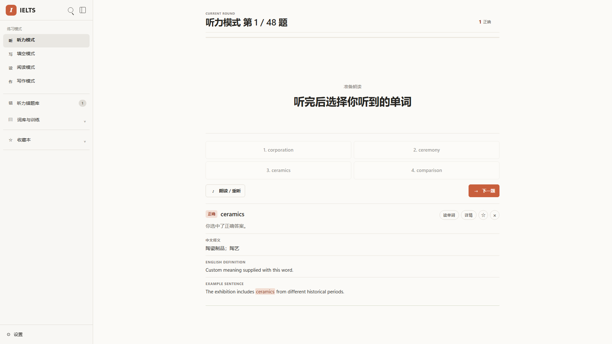

# IELTS Learning Lab

> A local-first IELTS practice application and a small research prototype for schema-constrained, automatically validated LLM vocabulary generation.

[Open the zero-key demo](https://yizihao8288-coder.github.io/ielts-learning-lab/demo/) · [Research status](https://yizihao8288-coder.github.io/ielts-learning-lab/results/) · [中文说明](README.zh-CN.md)



## Why this project exists

Vocabulary generators can return valid JSON while still producing unusable learning content: the requested word may change, a Chinese definition may contain no Chinese, or an example may omit the target phrase. IELTS Learning Lab separates two questions:

1. **Is the output structurally valid?**
2. **Is it usable as a vocabulary learning item?**

The product remains useful without any model. Listening, dictation, reading, writing, favourites, mistake review, browser storage and browser speech all work in the static demo. A local server can optionally request a generated item, validate it, and perform at most one repair.

## Try it

### Browser demo — no installation or API key

Use the [GitHub Pages demo](https://yizihao8288-coder.github.io/ielts-learning-lab/demo/). Data stays in that browser. The static build never calls the Python API.

### Local app — Windows

1. Install Python 3.10 or newer.
2. Double-click `启动雅思训练器.bat`.
3. The app opens at `http://127.0.0.1:8765`.

### Local app — macOS or Linux

```bash
python3 run.py
```

No package installation is required for core use. `run.py` binds only to `127.0.0.1`; generated runtime files remain under `.runtime/` or in ignored local state files.

## Research prototype

**Question.** In IELTS vocabulary item generation, does strict JSON Schema plus semantic validation and one repair improve final usability over a plain JSON prompt?

The shared validator checks:

- all four fields exist and are strings;
- the returned word matches the requested word or phrase;
- the Chinese meaning contains Chinese characters;
- the English meaning has a bounded length;
- the 8–35 word example contains the complete target;
- placeholders, meta-talk and duplicate content are absent.

| Condition | Generation constraint | Post-generation handling |
|---|---|---|
| `baseline` | JSON requested in the prompt | validation only |
| `schema` | strict JSON Schema | validation only |
| `guarded` | strict JSON Schema | validation + at most one repair |

**Current evidence status:** the pipeline and 12 automated tests are implemented; the planned 100-word × 3-condition × 3-repeat model evaluation and human blind review have **not** been run. No model-quality result is claimed yet. See [the protocol](docs/research-protocol.md).

Related methodology: [Wang et al. (2023)](https://aclanthology.org/2023.nlp4dh-1.7/), [JSONSchemaBench](https://arxiv.org/abs/2501.10868), and [Structured Output Benchmark](https://arxiv.org/abs/2604.25359).

## System boundary

```text
Static demo                         Optional local enhancement
Browser UI                          run.py (standard library)
├─ practice modes                   ├─ local save/load
├─ local dictionary                 ├─ POST /api/v1/generate-item
├─ browser storage                  └─ guarded generation pipeline
└─ browser speech                       ├─ strict schema
                                         ├─ semantic validation
                                         └─ one repair maximum
```

The API key is read only from the server environment. It is never embedded in the page, saved in snapshots, or written to experiment records. A target word is sent to the model only after the user clicks the online-generation button.

## API

```http
POST /api/v1/generate-item
Content-Type: application/json

{"word":"research"}
```

Success returns `item` and `provenance`. Missing credentials, network errors, rate limits and failed second validation return an explicit error plus `"fallback":"local_dictionary"`. The legacy `GET /define?word=...` route remains available.

Optional server configuration:

```text
OPENAI_API_KEY=...       # never commit this
OPENAI_MODEL=...         # defaults to gpt-5.6-luna
IELTS_PORT=8765
```

The Responses API request uses `reasoning.effort=none`, `store=false`, and strict `json_schema` output for the schema and guarded conditions. See the [official model documentation](https://developers.openai.com/api/docs/models/gpt-5.6-luna) and [Responses API reference](https://developers.openai.com/api/reference/resources/responses/methods/create).

## Verification

```bash
python -m unittest discover -s tests -v
python -m py_compile run.py research/pipeline.py
node --check app.js
```

Continuous integration repeats Python tests, JavaScript syntax checks, PowerShell parsing, and static-site assembly. The current local suite covers validator rules, repair limits, API input, no-key fallback, request size and path safety.

A deliberately small API smoke experiment (3 words × 3 conditions × 1 repeat) can be run with `python -m research.run_experiment`. The full planned call requires the explicit flags `--limit 100 --repeats 3`. Recompute metrics with `python -m research.evaluate PATH_TO_JSONL`.

## Privacy and limitations

- Personal answer history, timing records, API keys, caches and browser state are excluded from the public repository.
- The public 99-word source is used without personal response fields; the former CSV remains local and untracked.
- Browser speech and OCR availability vary by browser. OCR may fetch model data from a third-party CDN when the user invokes it.
- Automated constraints do not prove definition correctness or pedagogical quality. Human review is still required before making research claims.
- The present human-study status is “not run”, not “expert reviewed”.

## Authorship and AI assistance

Zihao Yi defined the learning problem, supplied the original application and vocabulary data, selected the research question, reviewed product behaviour, and is responsible for any future human ratings and conclusions. Codex was used as an AI-assisted engineering tool for implementation, refactoring, test scaffolding and documentation. The author should be able to explain every submitted component; this repository does not claim that all code was typed without assistance.

## Citation and licence

Citation metadata is in [`CITATION.cff`](CITATION.cff). Released under the [MIT License](LICENSE).
